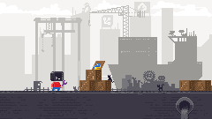

{:.full.pixels}

**Toolbx** is a tool for Linux systems, which allows the use of interactive command line environments for development and troubleshooting the host operating system, without having to install software on the host. It is built on top of [Podman](https://podman.io/) and other standard container technologies from [OCI](https://opencontainers.org/).

Learn more about Toolbox in the [documentation](https://github.com/containers/toolbox/blob/main/doc/toolbox.1.md).

## Installation & Use

* [Linux distro support](distros)
* [Installation Guide](install)
* FIXME: Convenient system integration with [Prompt]()
* FIXME: Toolbx integration in Builder

## Press
* [Articles about Toolbx](articles)
* [Press kit](/assets/logo/toolbx-logo.zip)

Press queries, including requests for comments and interviews can be directed to [press@lists.podman.io](mailto:press@lists.podman.io).

## Get Involved
Toolbx is Free Software and is developed in the open. Code can be found on [GitHub](https://github.com/containers/toolbox).

  * Join us on Matrix at [#toolbx:matrix.org](https://matrix.to/#/#toolbx:matrix.org).
  * Issues are tracked on [GitHub Issues](https://github.com/containers/toolbox/issues).
  * Security issues can be reported at a [private list](mailto:security@lists.podman.io). Here's our [security policy](https://github.com/containers/common/blob/main/SECURITY.md).
  * Contributors are bound to agree to our [Code of Conduct](https://github.com/containers/common/blob/main/CODE-OF-CONDUCT.md).
  * Follow us on [Mastodon/Fediverse](https://floss.social/@containertoolbx).

See our [contribution guide](https://github.com/containers/toolbox/blob/main/CONTRIBUTING.md) for further details.